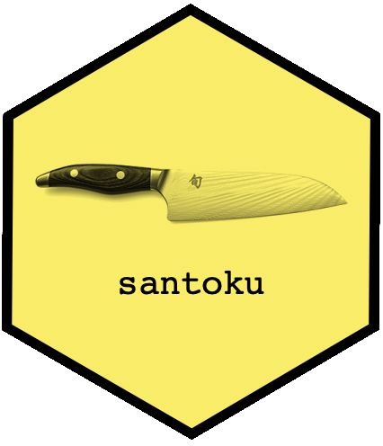

<!-- README.md is generated from README.Rmd. Please edit that file -->

```{r, include = FALSE}
knitr::opts_chunk$set(
  collapse = TRUE,
  comment = "#>",
  fig.path = "man/figures/README-",
  out.width = "100%"
)  

```

# santoku 

<!-- badges: start -->
[](https://CRAN.R-project.org/package=santoku)
[](https://lifecycle.r-lib.org/articles/stages.html)
[](https://CRAN.R-project.org/package=santoku)
[](https://hughjonesd.r-universe.dev/ui/#package:santoku)
[](https://github.com/hughjonesd/santoku/actions)
[](https://ci.appveyor.com/project/hughjonesd/santoku)
[](https://app.codecov.io/gh/hughjonesd/santoku?branch=master)
<!-- badges: end -->


```{r, child = 'advantages.Rmd'}
```


## Examples

```{r}
library(santoku)
```

`chop` returns a factor:

```{r}
chop(1:5, c(2, 4))
```

Include a number twice to match it exactly: 

```{r}
chop(1:5, c(2, 2, 4))
```

Use names in breaks for labels:

```{r}
chop(1:5, c(Low = 1, Mid = 2, High = 4))
```

Or use `lbl_*` functions:

```{r}
chop(1:5, c(2, 4), labels = lbl_dash())
```


Chop into fixed-width intervals:

```{r}
chop_width(runif(10), 0.1)
```

Or into fixed-size groups:

```{r}
chop_n(1:10, 5)
```


Chop dates by calendar month, then tabulate:

```{r}
library(lubridate)

dates <- as.Date("2021-12-31") + 1:90

tab_width(dates, months(1), labels = lbl_discrete(fmt = "%d %b"))
```

For more information, see the [vignette](https://hughjonesd.github.io/santoku/articles/santoku.html).
