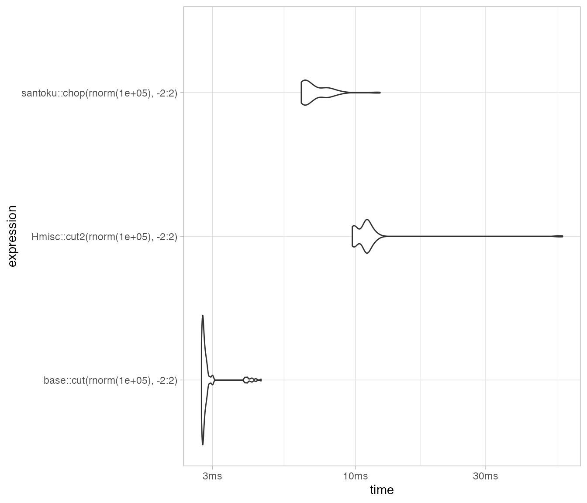
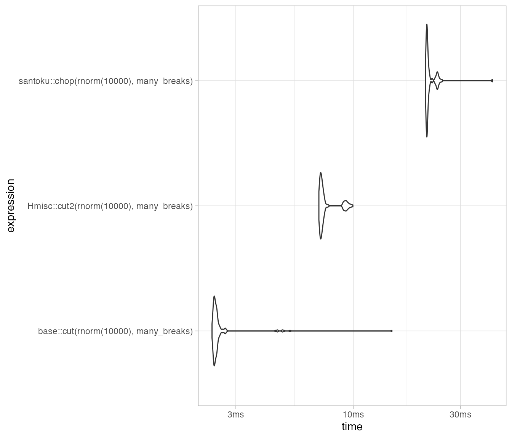
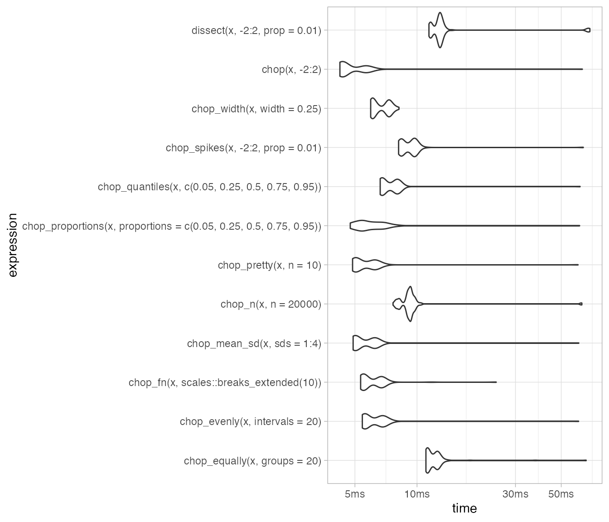

# Performance

## Speed

The core of santoku is written in C++. It is reasonably fast:

``` r


packageVersion("santoku")
#> [1] '1.2.0'
set.seed(27101975)

mb <- bench::mark(min_iterations = 100, check = FALSE,
        santoku::chop(rnorm(1e5), -2:2),
        base::cut(rnorm(1e5), -2:2),
        Hmisc::cut2(rnorm(1e5), -2:2)
      )
mb
#> # A tibble: 3 × 6
#>   expression                             min median `itr/sec` mem_alloc `gc/sec`
#>   <bch:expr>                        <bch:tm> <bch:>     <dbl> <bch:byt>    <dbl>
#> 1 santoku::chop(rnorm(1e+05), -2:2)   6.34ms 6.54ms      150.   10.21MB     64.5
#> 2 base::cut(rnorm(1e+05), -2:2)       2.73ms 2.78ms      357.    2.35MB     31.5
#> 3 Hmisc::cut2(rnorm(1e+05), -2:2)     9.74ms 9.88ms      101.    19.5MB    223.
```

``` r

autoplot(mb, type = "violin")
```



## Many breaks

``` r


many_breaks <- seq(-2, 2, 0.001)

mb_breaks <- bench::mark(min_iterations = 100, check = FALSE,
        santoku::chop(rnorm(1e4), many_breaks),
        base::cut(rnorm(1e4), many_breaks),
        Hmisc::cut2(rnorm(1e4), many_breaks)
      )

mb_breaks
#> # A tibble: 3 × 6
#>   expression                            min  median `itr/sec` mem_alloc `gc/sec`
#>   <bch:expr>                        <bch:t> <bch:t>     <dbl> <bch:byt>    <dbl>
#> 1 santoku::chop(rnorm(10000), many… 20.95ms 21.28ms      46.2    5.14MB     8.81
#> 2 base::cut(rnorm(10000), many_bre…  2.35ms  2.43ms     409.     1.39MB    17.7 
#> 3 Hmisc::cut2(rnorm(10000), many_b…  7.03ms   7.2ms     138.      5.7MB    32.5
```

``` r

autoplot(mb_breaks, type = "violin")
```



## Various chops

``` r


x <- c(rnorm(9e4), sample(-2:2, 1e4, replace = TRUE))

mb_various <- bench::mark(min_iterations = 100, check = FALSE,
        chop(x, -2:2),
        chop_equally(x, groups = 20),
        chop_n(x, n = 2e4),
        chop_quantiles(x, c(0.05, 0.25, 0.5, 0.75, 0.95)),
        chop_evenly(x, intervals = 20),
        chop_width(x, width = 0.25),
        chop_proportions(x, proportions = c(0.05, 0.25, 0.5, 0.75, 0.95)),
        chop_mean_sd(x, sds = 1:4),
        chop_fn(x, scales::breaks_extended(10)),
        chop_pretty(x, n = 10),
        chop_spikes(x, -2:2, prop = 0.01),
        dissect(x, -2:2, prop = 0.01)
      )
      
mb_various
#> # A tibble: 12 × 6
#>    expression                           min  median `itr/sec` mem_alloc `gc/sec`
#>    <bch:expr>                       <bch:t> <bch:t>     <dbl> <bch:byt>    <dbl>
#>  1 chop(x, -2:2)                     4.23ms  4.33ms     229.     8.63MB    118. 
#>  2 chop_equally(x, groups = 20)     11.04ms  11.2ms      88.5   12.18MB     72.4
#>  3 chop_n(x, n = 20000)              7.65ms  8.11ms     124.     23.5MB    507. 
#>  4 chop_quantiles(x, c(0.05, 0.25,…  6.63ms  6.75ms     147.    12.08MB    125. 
#>  5 chop_evenly(x, intervals = 20)    5.43ms  5.57ms     178.    12.48MB    152. 
#>  6 chop_width(x, width = 0.25)       5.96ms  6.08ms     163.    12.53MB    139. 
#>  7 chop_proportions(x, proportions…  4.75ms  5.37ms     190.    12.48MB    162. 
#>  8 chop_mean_sd(x, sds = 1:4)         4.9ms     5ms     198.    11.36MB    150. 
#>  9 chop_fn(x, scales::breaks_exten…  5.33ms   5.5ms     177.    11.47MB    123. 
#> 10 chop_pretty(x, n = 10)            4.87ms  5.02ms     197.    10.58MB    142. 
#> 11 chop_spikes(x, -2:2, prop = 0.0…  8.14ms  8.41ms     119.    14.62MB    137. 
#> 12 dissect(x, -2:2, prop = 0.01)    11.42ms 11.61ms      85.6   22.27MB    257.
```

``` r

autoplot(mb_various, type = "violin")
```


